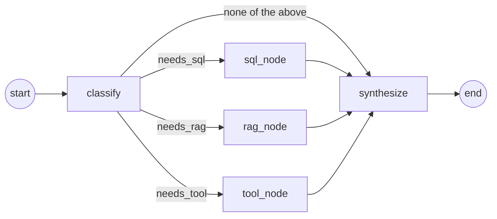

# Architecture

## System overview

```mermaid
flowchart TB
    subgraph Client
        UI[Any HTTP client / future web UI]
    end

    subgraph FastAPI["FastAPI app (app/main.py)"]
        AUTH["/auth/login, /auth/me\nJWT issuance"]
        CHAT["/chat\nSSE streaming endpoint"]
        CONV["/conversations\nhistory"]
        APPR["/approvals\nhuman-in-the-loop"]
        MW["Request logging middleware\n(structlog JSON, request_id)"]
    end

    subgraph Agent["LangGraph agent (app/agent/)"]
        CLS[classify_node]
        RAGN[rag_node]
        SQLN[sql_node]
        TOOLN[tool_node]
        SYN[synthesize_node]
        CLS -->|needs_rag| RAGN
        CLS -->|needs_sql| SQLN
        CLS -->|needs_tool| TOOLN
        RAGN --> SYN
        SQLN --> SYN
        TOOLN --> SYN
    end

    subgraph Data["Data layer"]
        SQLDB[(SQLite\ncustomers/orders/invoices/tickets/\nusers/conversations/approvals)]
        VDB[(Chroma vector store\nlocal ONNX MiniLM embeddings)]
        KB[[knowledge_base/*.md\n16 enterprise documents]]
    end

    subgraph Safety["Backend-enforced safety (never LLM-trusted)"]
        GUARD[SQL guard\nAST allow-list + read-only connection + row cap]
        PERM[Tool permissions\nRBAC + forced row-level scoping]
        EXEC[Tool executor\ntimeout + retry + re-authorization]
    end

    subgraph LLM["LLM provider (app/agent/llm.py)"]
        OFF[Offline deterministic model\n(tests / CI / no API key)]
        REAL[Anthropic / OpenAI / Gemini\nvia LangChain chat model wrappers]
    end

    UI -->|Bearer JWT| AUTH
    UI -->|Bearer JWT| CHAT
    UI --> CONV
    UI --> APPR
    CHAT --> MW
    CHAT --> Agent
    SQLN --> GUARD --> SQLDB
    RAGN --> VDB
    KB -->|ingest.py: chunk + embed| VDB
    TOOLN --> PERM --> EXEC --> SQLDB
    APPR --> EXEC
    CLS -.->|classification| LLM
    SYN -.->|final answer| LLM
    CHAT --> SQLDB
```

## LangGraph agent flow (per chat turn)



- **classify**: decides which capability/capabilities the question needs (LLM structured-output classification with a deterministic keyword-based fallback; the fallback is the *only* path in offline mode, which keeps routing fully testable without a live model). Also resolves any customer reference to a concrete `customer_id` — for a `customer`-role caller this is *always* forced to their own account, never taken from the query text.
- **sql_node** / **rag_node** / **tool_node**: any subset can run in the same turn (this is how the canonical "find outstanding invoices and check policy violation" question does SQL *and* RAG in one turn). Each branch runs concurrently in the same LangGraph superstep; `trace`/`step_count` use additive reducers so concurrent branch writes merge instead of colliding.
- **synthesize**: builds one prompt from conversation history + retrieved documents (wrapped as explicitly untrusted data) + SQL results + tool results, and asks the LLM (or the offline stand-in) for the final answer. Citations are computed from the RAG chunks actually retrieved, not asserted by the model.
- **Loop prevention**: the graph is acyclic by construction, but every invocation still passes `recursion_limit` (`AGENT_MAX_STEPS`, default 8) to LangGraph, so even a future change that introduces a re-planning loop cannot run away unbounded. A `GraphRecursionError` is caught and converted into a safe, user-facing message rather than a crash.

## Why these design choices

- **Human approval is a plain REST resource, not a graph interrupt.** `tool_node` stops *before* executing a write tool, persists a `PendingApproval` row, and returns. A separate `POST /approvals/{id}/decide` endpoint executes the tool only after an explicit decision. This was chosen over LangGraph's interrupt/resume machinery because it's dramatically simpler to reason about and test (a plain request/response with normal HTTP status codes for "already decided," "not yours to decide," etc.) while fully satisfying "no modifying action without human confirmation."
- **Authorization lives in the backend, in one place, twice-checked.** `app/tools/permissions.py` is the single source of truth for which role can call which tool, and it forcibly rewrites (never just validates) a `customer`-role caller's `customer_id` to their own account. `app/tools/executor.py` re-runs this check immediately before every execution — including the second time, after human approval — so nothing about authorization ever depends on what the classifier or the LLM decided.
- **SQL safety is defense-in-depth, not one check.** `app/db/sql_guard.py` stacks three independent layers: AST allow-listing (sqlglot) restricted to 4 whitelisted tables and `SELECT`-only, an OS-level read-only SQLite connection (`mode=ro` + `PRAGMA query_only`) so a validation bug still can't write, and a hard row cap. Customers never get raw SQL access at all — only staff roles do, and only against invoices/orders/customers/support_tickets.
- **RAG uses a local embedding model (Chroma's built-in ONNX MiniLM)**, not an external embeddings API. This means retrieval works fully offline/deterministically (important for CI and the eval suite) and doesn't add a second API-key dependency on top of the chat LLM.
- **The LLM layer is provider-agnostic and has a real offline mode**, not a mock. `OfflineChatModel` parses the same structured prompt blocks (`<retrieved_documents>`, `<sql_results>`, `<tool_result>`) a real model would see and answers from them directly — so the entire pipeline (routing, retrieval, SQL scoping, permission enforcement, citation formatting, no-hallucination behavior) is exercised and verifiable without any API key, while `LLM_PROVIDER=anthropic|openai|gemini` switches to a real model with no code changes.
- **Every retrieved document is wrapped as explicitly untrusted data** in the synthesis prompt (`format_context_block`), with an explicit instruction to never follow instructions found inside it. This is deliberately paired with a knowledge-base document (`SUP-003`) that contains a real embedded prompt-injection attempt, so the defense is exercised by an actual test case (`SEC-01`/`SEC-04` in `eval/cases.py`, and `test_prompt_injection_attempt_does_not_expand_scope`), not just asserted in a comment.
